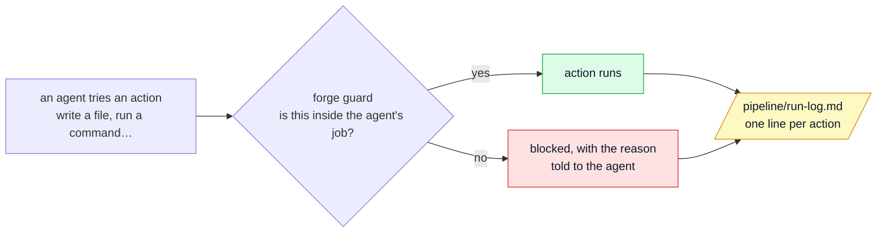

# forge

forge turns a research idea into working, tested code, one checked step at a time. You stay in control: every stage stops for your approval, every action is logged, and the rules each AI agent must follow are enforced by code, not by asking it nicely.

New to forge? Start with the **[quick setup guide](docs/QUICKSTART.md)**. Once forge is set up, a whole project is:

```bash
forge new my-project       # creates the project and opens the Interrogator; approve the brief, then /exit
forge                      # in the project: opens the right session for where it stands
```

and inside Claude Code just two commands, repeated: **`/forge:next`** (runs the next stage) and **`/forge:approve <what it names>`**.

## How the agents work together

Each box is an AI agent (with its model), each slanted box is a file it writes, and each hexagon is a point where **you** approve before anything else happens. Grey boxes are plain programs, not AI.

```mermaid
flowchart TD
    idea(["💡 your idea"])

    subgraph S1["① Interrogate · forge new / forge"]
        INT["Interrogator<br/>Sonnet · asks you questions"]
    end
    idea --> INT
    INT --> brief[/"brief.md"/]
    brief --> A1{{"✋ /forge:approve brief"}}

    subgraph S2["② Investigate · /forge:investigate"]
        CUR["Mr. Curiosity × one per sub-question<br/>Sonnet · searches the web"]
        HH1["Hungry-hippo<br/>Haiku · fetches seed papers, checks IDs"]
    end
    A1 --> CUR & HH1
    CUR -- "paper IDs" --> HH1
    HH1 --> cand[/"candidates.md"/]
    cand --> A2{{"✋ keep / drop papers<br/>/forge:approve candidates"}}

    subgraph S2b["② Investigate · /forge:investigate-index"]
        HH2["Hungry-hippo<br/>Haiku · brings in kept papers"]
        REFS["refs + Marker<br/>pool → download → PDF to Markdown"]
        PTR["Pointer × one per sub-question<br/>Haiku · finds the exact passages"]
    end
    A2 --> HH2 --> REFS --> PTR
    PTR --> index[/"index.md<br/>question → paper, section, lines"/]
    index --> A3{{"✋ /forge:approve index"}}

    subgraph S3["③ Plan · /forge:plan · up to 3 rounds"]
        OZ1["Ozymandias<br/>Opus · drafts / revises"]
        BUB["Bubastis × one per code question<br/>Haiku · fetches a paper's repo, points to the lines"]
        OZ1 -. "code questions" .-> BUB
        BUB -. "file:line pointers (C-n)" .-> OZ1
        JJJ["J. Jonah Jameson<br/>Sonnet · criticises, with evidence"]
        SM["Smithers<br/>Sonnet · rebuts or concedes"]
        OZ2["Ozymandias<br/>Opus · rules on every critique"]
        OZ3["Ozymandias<br/>Opus · writes the tests"]
        OZ1 --> JJJ --> SM --> OZ2
        OZ2 -- "an accepted major problem remains" --> OZ1
    end
    A3 --> OZ1
    OZ2 -- "no major problem left" --> OZ3
    OZ3 --> plan[/"design.md · plan.md · ledger.md · tests/"/]

    plan --> A4{{"✋ ④ you read design.md<br/>/forge:approve design<br/>🔒 tests/ are now locked"}}

    subgraph S5["⑤ Build · /forge:build · one slice per run"]
        MF["MF-CODE<br/>Sonnet · writes the code for one slice"]
        FT["forge-test<br/>runs the slice's tests, records the result"]
        MF --> FT
        FT -- "fail, up to 3 attempts" --> MF
    end
    A4 --> MF
    FT -- "pass" --> slice[/"slices/slice-N.md"/]
    FT -- "still failing after 3" --> blocker[/"blocker report<br/>back to planning"/]
    slice --> A5{{"✋ /forge:approve slice-N"}}
    A5 -- "more slices" --> MF
    A5 -- "last slice done" --> REV["Reviewer<br/>Sonnet · compares code with plan"]
    REV --> review[/"review.md"/]

    classDef agent fill:#dbeafe,stroke:#2563eb,color:#0f172a
    classDef file fill:#fef9c3,stroke:#ca8a04,color:#0f172a
    classDef gate fill:#dcfce7,stroke:#16a34a,color:#0f172a
    classDef tool fill:#e5e7eb,stroke:#6b7280,color:#0f172a
    class INT,CUR,HH1,HH2,PTR,OZ1,BUB,JJJ,SM,OZ2,OZ3,MF,REV agent
    class brief,cand,index,plan,slice,blocker,review file
    class A1,A2,A3,A4,A5 gate
    class REFS,FT tool
```



### Who does what

| Agent | Model | Stage | Job | May write |
|---|---|---|---|---|
| **Interrogator** | Sonnet | 1 | Talks with you until the idea is precise | `pipeline/brief.md` |
| **Mr. Curiosity** | Sonnet | 2 | Searches for papers, one instance per research sub-question | nothing |
| **Hungry-hippo** | Haiku | 2 | The clerk: runs `refs` to verify, fetch and convert papers | `pipeline/candidates.md` |
| **Pointer** | Haiku | 2 | Finds which paper, section and lines answer each sub-question | `pipeline/index.md` |
| **Ozymandias** | Opus | 3 | Architect and judge: builds the project environment, drafts the design, checks facts with small probes, rules on critiques, writes tests | `design.md`, `plan.md`, `ledger.md`, `tests/`, `pipeline/env/`, probe scripts |
| **Bubastis** | Haiku | 3 | Code scout: fetches a repository a paper links to (`refs code fetch`), searches it for what Ozymandias asked, and returns the answer with file and line pointers, one instance per question | `pipeline/code/findings.md` |
| **J. Jonah Jameson** | Sonnet | 3 | Critic: a fresh instance every round, attacks the plan with evidence | nothing |
| **Smithers** | Sonnet | 3 | Defender: rebuts each critique with evidence, or concedes it | nothing |
| **MF-CODE** | Sonnet | 5 | Builds one slice of the plan, inside the environment built during Plan | `src/`, `docs/`, … never `tests/` or `pipeline/env/` |
| **Reviewer** | Sonnet | 5 | Checks that what was built is what was planned | `pipeline/review.md` |

### The guard: how every action is checked

Agents don't just promise to follow these rules. A hook that Claude Code runs before every action enforces them:



## What forge is, in plain English

forge is a **plugin for Claude Code**. A plugin is a folder that Claude Code loads to gain new abilities. forge uses five kinds of building blocks that Claude Code understands:

| Building block | What it is | In forge |
|---|---|---|
| **Agents** (`agents/*.md`) | A specialised AI worker: a role description, a model (Opus, Sonnet or Haiku), an effort level (Sonnet and Opus agents only) and a list of tools it may use. | Interrogator, Hungry-hippo, Mr. Curiosity, Pointer, Ozymandias, Bubastis, J. Jonah Jameson, Smithers, MF-CODE, Reviewer |
| **Skills** (`skills/*/SKILL.md`) | Commands you type, such as `/forge:status`. | `/forge:next`, `/forge:approve`, `/forge:status`, `/forge:init` |
| **Workflows** (`workflows/*.js`) | Small JavaScript programs that run agents in a fixed order. The *script*, not the AI, decides what runs next, so steps can't be skipped. | `/forge:investigate`, `/forge:investigate-index`, `/forge:plan`, `/forge:build` |
| **Hooks** (`hooks/`) | Code that Claude Code runs before and after every action an agent takes. It can block the action. | the **forge guard**: it allows each agent only its own job and writes the logbook |
| **Tools** (`bin/`) | Ordinary command-line programs that agents (and you) can run. | `forge` (the launcher), `refs` (papers, and the code repositories they link), `forge-init`, `forge-approve`, `forge-gate`, `forge-env` (the project environment), `forge-probe` (small checks during Plan), `forge-test`, `forge-build-status` |

So forge is not one thing. It is a set of agents with narrow jobs, workflows that run them in order, a guard that keeps them in their lane, and tools that do the parts that should be exact (downloading, converting, checking, testing) without AI.

## The pipeline, step by step

Each stage reads the files the previous stage wrote, and refuses to start until you've approved them. You don't need to remember the commands below: `/forge:next` always runs the right one, and `forge status` (in a terminal) tells you where you are.

### 1. Interrogator: from idea to brief

You talk with the Interrogator until your idea is precise. If you name papers, it fetches and converts them (through `refs`) and reads them, so its questions are informed. It writes `pipeline/brief.md`: goal, non-goals, hypothesis, acceptance criteria that can be tested, constraints, the environment you want (pixi, conda, docker or venv; Python version, system tools such as ffmpeg, GPU), research sub-questions, seed references.

- Start it: `forge new <folder>` for a new project, or `forge` in a project whose brief isn't approved yet
- Approve: `/forge:approve brief`

### 2. Investigate: from brief to the right passages in the right papers

- `/forge:investigate`: checks your seed papers, runs one **Mr. Curiosity** search per research sub-question, verifies that every paper ID really exists (Crossref or arXiv), and writes `pipeline/candidates.md`. You keep or drop papers there, then `/forge:approve candidates`.
- `/forge:investigate-index`: **Hungry-hippo** brings in the papers you kept (from your paper pool if they're there, otherwise download and convert to Markdown), then **Pointer** agents write `pipeline/index.md`: for each sub-question, which paper, section and lines answer it. Review it, then `/forge:approve index`.

### 3. Plan: a council argues about the design

`/forge:plan` runs up to 3 rounds of:

1. **Ozymandias** (Opus) drafts or revises `pipeline/design.md` (for you) and `pipeline/plan.md` (for the builder). In the first round it writes the environment spec in `pipeline/env/` (as the brief asks) and builds it with `forge-env create`. When a decision depends on a fact it can check cheaply, it runs a **probe** with `forge-probe`: a short script with one stated claim and pass condition, such as ffprobe on the dataset's sample rate, or a spectrogram that should show the predicted peaks. Probes run in the project environment, stop after 10 minutes, may not change project files, and `forge-probe` itself records what they showed in `pipeline/probes/probes.md`.
   When the papers link their code (GitHub or GitLab), Ozymandias can ask about it: the exact preprocessing, a default hyperparameter, how a loss is weighted. It doesn't search the repository itself, which would spend Opus tokens on reading code. It names the repository and the question, and the workflow sends a **Bubastis** scout (Haiku) per question. Bubastis fetches the repository with `refs code fetch` (one commit, text files only, at most 50 MB, into `references/code/`) and returns the answer with file and line pointers. Ozymandias then reads only those lines in its next task and cites them as `C-n`. Round 1 starts with a short step where Ozymandias decides what to look up before drafting. A run makes at most 12 lookups (4 per task), and every one is recorded in `pipeline/code/findings.md`. The code is read as evidence and never run.
2. **J. Jonah Jameson** criticises them. Every critique needs evidence: an index row, a paper, a probe (`P-n`) or a code finding (`C-n`).
3. **Smithers** rebuts each critique with evidence or concedes it.
4. **Ozymandias** rules on every critique: accepted or rejected, with a reason.

It stops when no accepted major problem remains, or after 3 rounds. Everything is recorded in `pipeline/ledger.md`. Then Ozymandias writes the tests in `tests/`.

### 4. You review the design

Read `pipeline/design.md` (short, written for you) and, if you want the debate, `pipeline/ledger.md`. If you agree: `/forge:approve design`. That also **locks `tests/`**: from then on no agent can change a test. It also fingerprints `pipeline/env/`, so the build runs in exactly the environment the plan was made and probed in.

### 5. Build: one slice at a time

`/forge:build` builds the next slice of the plan. **MF-CODE** writes the code, running it inside the project environment (`forge-env run ...`). Then `forge-test` runs the slice's tests exactly as the approved plan states them, and records the result itself, so the agent can't claim a pass. At most 3 attempts; after that it stops with a blocker report instead of looping. Read `pipeline/slices/slice-N.md`, then `/forge:approve slice-N`, then `/forge:build` again. After the last slice, a **Reviewer** compares the code with the plan and writes `pipeline/review.md`.

At any point, `/forge:status` tells you where the project stands and what to do next.

## How forge keeps control

- **One job per agent, enforced.** The guard hook knows which agent is acting (Claude Code tells it) and blocks anything outside that agent's job: the Interrogator can only write the brief, the critic can only read, the builder can't touch `tests/`, and a plain Claude session in a forge project can only look.
- **Approvals are fingerprints.** `/forge:approve` stores a fingerprint of the approved files. If anything changes afterwards, the approval no longer counts and the next stage won't start. Only your typed command can approve; agents are blocked from doing it.
- **The logbook.** Every action of every agent, including blocked attempts, is a line in `pipeline/run-log.md`.
- **Exact work is done by code.** Downloading, converting, checking paper IDs and running tests are done by programs, not by the AI.
- **Visible progress.** Workflows show their phases live in `/workflows`.

## Papers: `refs`, Marker and the paper pool

Agents never read PDFs. Papers are converted to Markdown once, and agents read the Markdown, which saves a lot of tokens.

- `refs fetch <DOI or arXiv ID>`: first looks in your **paper pool**, then downloads open-access PDFs. Paywalled ones go to `references/MISSING.md`; drop the PDF into `references/inbox/` yourself.
- `refs convert`: converts the PDFs in `references/inbox/` to Markdown with **Marker**, a free program that runs on your own computer (no paid service). The Marker server starts automatically. Results are cached, so a paper is never converted twice.
- `refs status`, `refs resolve <IDs>`, `refs catalog`, `refs bib`.

**The paper pool** is a folder of papers you've already converted, such as your Obsidian vault: one folder per paper, with a `.md` file and an `assets/` folder. `refs fetch` copies a paper from the pool when it finds it (by arXiv ID, DOI or title), with no download and no conversion.

```bash
refs pool add "/Users/daveloay/Documents/Obsidian Vault"   # once per machine
refs pool list                                            # what's in it
refs pool find sonics                                     # search by title words
```

## Files in a forge project

```
my-project/
  references/            papers: one folder per paper (<key>.md, images/, maybe <key>.pdf)
    inbox/               drop PDFs here
    catalog.md  references.bib  MISSING.md
  pipeline/
    brief.md  candidates.md  index.md  design.md  plan.md  ledger.md
    slices/              one report and one test record per build slice
    approvals/           your approvals (fingerprints)
    run-log.md           the logbook
    build-log.md  review.md
  tests/                 written by the plan stage, locked when you approve the design
  src/                   the code
```

## Setting up on a new machine

The short version is in the [quick setup guide](docs/QUICKSTART.md). On macOS or Linux:

```bash
git clone git@github.com:DaveLoay/forge.git ~/forge
bash ~/forge/scripts/setup.sh --pool "/path/to/your/vault" --test
```

`setup.sh` checks Python, git and Claude Code, installs Marker (into `~/.local/share/forge`), tells you how Marker will use the GPU, installs forge as a Claude Code plugin (so plain `claude` loads it, no `--plugin-dir`), puts the `forge` command in `~/.local/bin`, registers the paper pool, and with `--test` converts one real paper end to end. It never uses `sudo`; anything that needs root is printed for you to run. It is safe to re-run.

Then, once: in Claude Code, `/config` → turn on **Dynamic workflows** (on the Pro plan it starts switched off). Update forge later with `forge update`.

## Running on a server

forge has no macOS-specific parts at runtime; the setup above is the same on a Linux server. What else changes on a server:

- **Get forge onto the server.** Keep forge in a (private) GitHub repository and `git clone` it on the server; `forge update` pulls and refreshes the plugin.
- **Claude Code on the server.** Install it there, log in once, and turn on Dynamic workflows in `/config`. Run it inside `tmux` or `screen`, so a long `/forge:plan` or `/forge:build` keeps running if your SSH connection drops.
- **Marker on the server.** With an NVIDIA GPU, Marker runs its model in a Docker container (vLLM), so the server needs Docker and the NVIDIA Container Toolkit; the first conversion downloads the container and the model (several GB). Without Docker, build `llama.cpp` with CUDA and set `export SURYA_INFERENCE_BACKEND=llamacpp`. `setup.sh` tells you which applies.
- **The paper pool on the server.** Your Obsidian vault lives on your Mac, so the server needs a copy of the papers folder, kept in sync with `rsync`, Syncthing or git. Then run `refs pool add <that folder>` on the server.
- **Data paths.** Plans and tests may name data folders (this project's plan names `/Users/daveloay/Documents/raw_materials`). On the server, keep the data at a path the brief names, or say the server path when you talk to the Interrogator.

## Reference

| Command | What it does |
|---|---|
| `forge new <folder>` | (terminal) Create a forge project and open the Interrogator |
| `forge` | (terminal, in a project) Open the right Claude Code session for where the project stands |
| `forge status` | (terminal) Where the project stands and what to type next |
| `forge update` | (terminal) Pull the latest forge and refresh the plugin |
| `/forge:next` | Run the next stage, or say exactly what to read and approve |
| `/forge:approve <brief, candidates, index, design, slice-N>` | Record your approval |
| `/forge:status` | Fuller report: approvals, papers, build, last logbook lines |
| `/forge:init` | Create the forge layout in the current folder (`forge new` does this for you) |
| `/forge:investigate`, `/forge:investigate-index`, `/forge:plan`, `/forge:build` | The stage workflows, if you want to run one directly |
| `claude --agent forge:interrogator` | Stage 1 by hand (what `forge` runs for you) |

For developers: the design and its history are in [`docs/BUILD_PLAN.md`](docs/BUILD_PLAN.md). Run the tests with `python3 -m unittest discover -s tests`, and check the plugin with `claude plugin validate .`.
